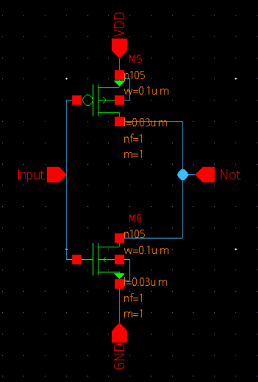
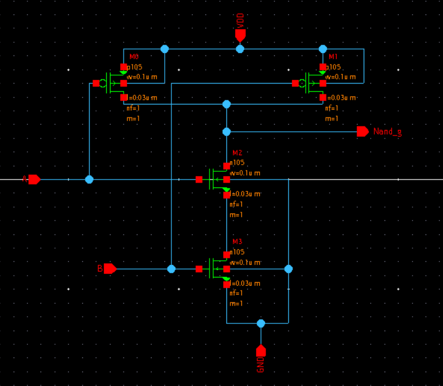
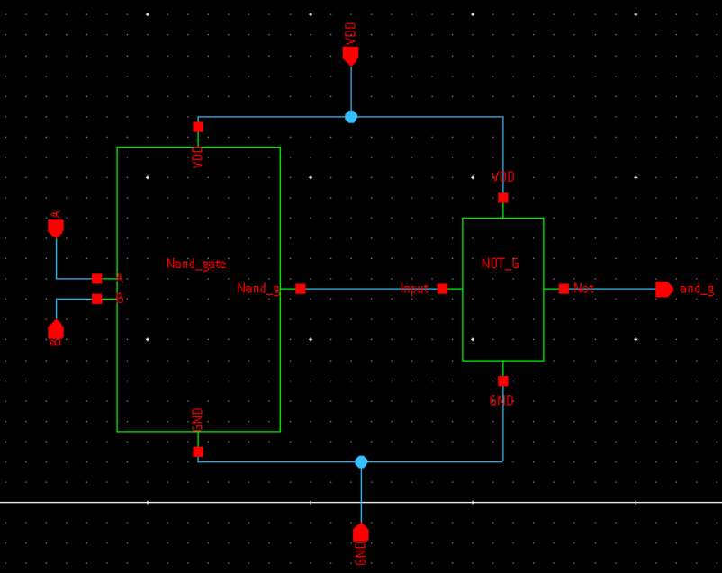
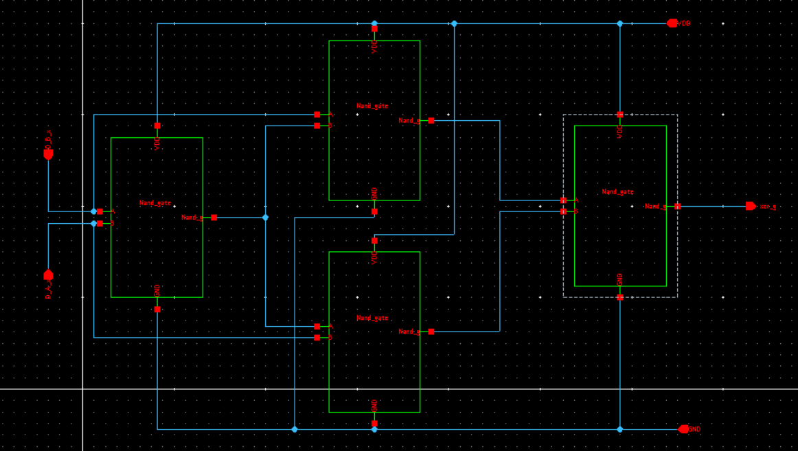
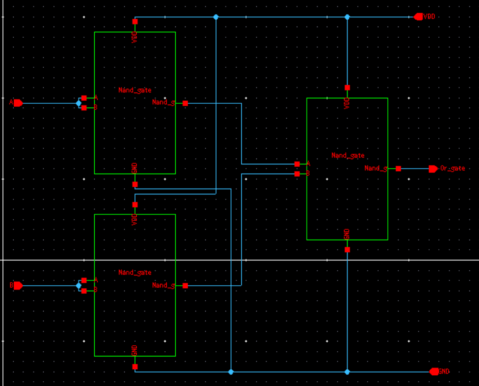
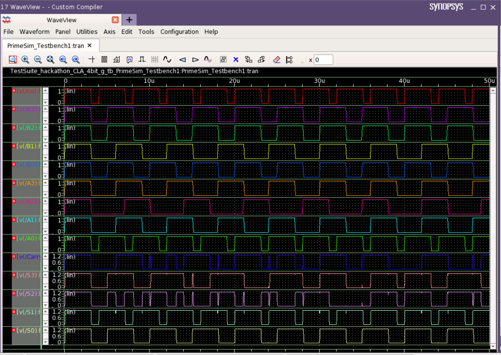

# 4-bit_carry_look_ahead_adder
This repository presents the design of 4-bit CLA adder implemented using Synopsis Custom Compiler on 28nm CMOS Technology.

##  Table Of Content
   * [Abstract](#Abstract)
   * [Detailed Explanation](#Detailed-Explanation)
   * [Reference Circuit block diagram](#Reference-Circuit-block-diagram)
   * [Tools Used](#Tools-Used)
   * [CMOS NOT Gate](#CMOS-NOT-Gate)
   * [CMOS NAND Gate](#CMOS-NAND-Gate)
   * [AND Gate](#AND-Gate)
   * [XOR Gate](#XOR-Gate)
   * [OR Gate](#OR-Gate)
   * [Half Adder Module](#Half-Adder-Module)
   * [Full Adder Module](#Full-Adder-Module)
   * [Design Approach](#Design-Approach)
   * [First carry generator](#First-carry-generator)
   * [Second carry generator](#Second-carry-generator)
   * [Third carry generator](#Third-carry-generator)
   * [Final carry generator](#Final-carry-generator)
   * [Combining blocks](#Combining-blocks)
   * [Simulations](#Simulations)
   * [Netlist](#Netlist)
   * [Acknowledgements](#Acknowledgements)
   * [References](#References)
 
## Abstract

A 28nM CMOS 4-bit Carry look Ahead Adder (CLA adder) is proposed. A ripple carry adder is a digital circuit that produces the arithmetic sum of two binary numbers. It can be constructed with full adders connected cascaded with carry output. Each full adder block depends on the previous full adder block for the output which creates a time delay. Carry Look Ahead Adder is a very efficient adder since it can reduce time taken to create the carry bits.

## Detailed Explanation

Fig.1 represents the block diagram for a 4 bit CLA adder, which is based on a ripple carry adder circuit with an additional propagation block. The carry bits are provided by a propagation block which reduces the time delay present in the ripple carry adder. This is achieved by converting all the carry signals such as C1, C2, C3 as a function of C0. The expression for the carry propagate Pi (1), generates signal Gi (2), sum (3), and carry out Ci+1 (4).

Pi = Ai ⊕ Bi … (1)  
Gi = Ai . Bi … (2)   
The output sum and carry can be expressed as
Si = Pi ⊕ Ci … (3)  
Ci+1 = Gi + (Pi . Ci) … (4)  
Where i = 0,1,2…..n-1. 

For 4 bit CLA the below equations are formed with the help of (1), (2), (3) and (4)

C1 = G0 + P0C0 … (5)  
C2 = G1 + P1C1 = G1 + P1(G0 + P0C0) = G1 + P1G0 + P1P0C0 … (6)  
C3 = G2 + P2C2 = G2 + P2G1 + P2P1G0 + P2P1P0C0  … (7)  
C4 = G3 + P3C3 = G3 + P3G2 + P3P2G1 + P3P2P1G0 + P3P2P1 P0C0.  … (8)  

The equations of propagate, generate, sum and carry signal are going to repeat for n number of bits such as for 8,16,32etc.

    
## Reference Circuit block diagram

 
  REFERENCE CIRCUIT BLOCK DIAGRAM 

## Tools Used

- Synopsys Custom Compiler:  The Synopsys Custom Compiler™ design environment is a modern solution for full-custom analog, custom digital, and mixed-signal IC design. As the heart of the Synopsys Custom Design Platform, Custom Compiler provides design entry, simulation management and analysis, and custom layout editing features. This tool was used to design the circuit on a transistor level.
- Synopsys Primewave:  PrimeWave™ Design Environment is a comprehensive and flexible environment for simulation setup and analysis of analog, RF, mixed-signal design, custom-digital and memory designs within the Synopsys Custom Design Platform. This tool helped in various types of simulations of the above designed circuit.
- Synopsys 28nm PDK:  The Synopsys 28nm Process Design Kit(PDK) was used in creation and simulation of the above designed circuit.

## CMOS NOT Gate

   
  NOT GATE SCHEMATIC 
  

## CMOS NAND Gate

   
  NAND GATE SCHEMATIC 
  

## AND Gate

   
  AND GATE SCHEMATIC 
  

## XOR Gate

   
  XOR GATE SCHEMATIC 
  

## OR Gate

   
  OR GATE SCHEMATIC 
  

## Half Adder Module

 
  HALF ADDER USING BASIC GATES  

## Full Adder Module

 
 FULL ADDER USING HALF ADDERS  

## Design Approach

First, an basic invertor was made, then universal gate which was NAND gate was made with the help COMS circuit, with the help of it other gates basic gates like AND, OR, XOR were made. Then with help of basic gates half adder circuit was made. By combining halfadders a fulladder was made.

Then first propogation block was made for C1 with equation 1, with the help this block C2, C3, C4 were build with the help of previous blocks and equations (5), (6), (7), (8).

Now 4 carry generator blocks were build the inputs of these blocks were given to full adders which completetes the complete circuit.

## First carry generator

 
  First carry generator  

## Second carry generator 

 
  Second carry generator 

## Third carry generator

In the below shown schematic, module generates partial product terms A6B and A7B.
These Partial products are passed to next layer for reduction. This layer uses only Halfadders and Fulladders.

 
  Third carry generator 

## Final carry generator

 
  Final carry generator 

## Combining blocks

 
 Combining blocks 

## Simulations

 
  Test bench for CLA Adder

 

 
  Test bench for CLA Adder

## Netlist

Refer to the netlist of the circuits here: <a href='/files/netlist.txt'> Netlist </a>

## Author

- Sai Venkat Bala badruni, BTech Electronics and commuincations, Amrita school of Engineering, Thiruvallur, Chennai 601103.

## Acknowledgements

 - [Dr. Sivasundar Manisankar, Assistant Professor (Senior Grade), Assistant Professor (Senior Grade)](https://www.linkedin.com/in/dr-sivasundar-manisankar-51872946/) 
 - [Kunal Ghosh, Co-founder, VSD Corp. Pvt. Ltd.](https://www.iith.ac.in/events/2022/02/15/Cloud-Based-Analog-IC-Design-Hackathon/)
 - [Cloud Based Analog IC Design Hackathon](https://www.iith.ac.in/events/2022/02/15/Cloud-Based-Analog-IC-Design-Hackathon/)
 - [Synopsys India](https://www.synopsys.com/)
 - [Sameer Durgoji, NIT Karnataka](https://www.iith.ac.in/events/2022/02/15/Cloud-Based-Analog-IC-Design-Hackathon/)
 - [Chinmay panda, IIT Hyderabad](https://www.iith.ac.in/events/2022/02/15/Cloud-Based-Analog-IC-Design-Hackathon/)
 
## References
- [1] Lily Kanoriya,Aparna Gupta,Dr. Soni Changlani, "Layout Designing and Transient Analysis of Carry Lookahead Adder Using 300nm Technology-A Review", International Journal of       Engineering Development and Research (IJEDR), ISSN:2321-9939, Vol.4, Issue 2, pp.467-472, May 2016 (http://www.ijedr.org/papers/IJEDR1602084.pdf).
- [2] ELPROCUS “Carry Look Ahead Adder – Circuit, Truth Table & Applications”  (https://www.elprocus.com/carry-look-ahead-adder/).
